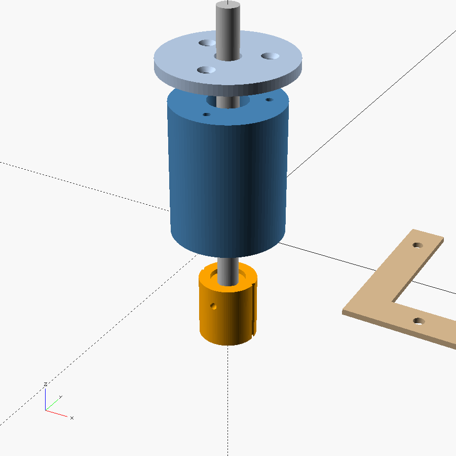
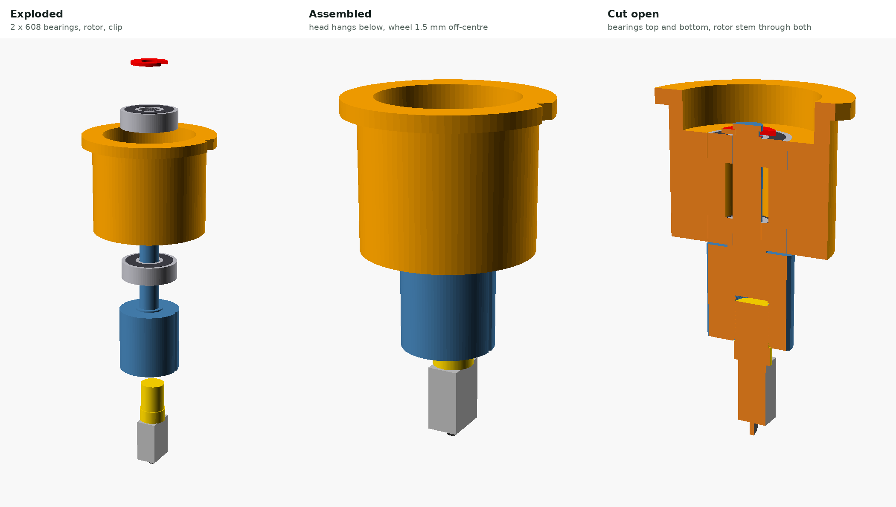
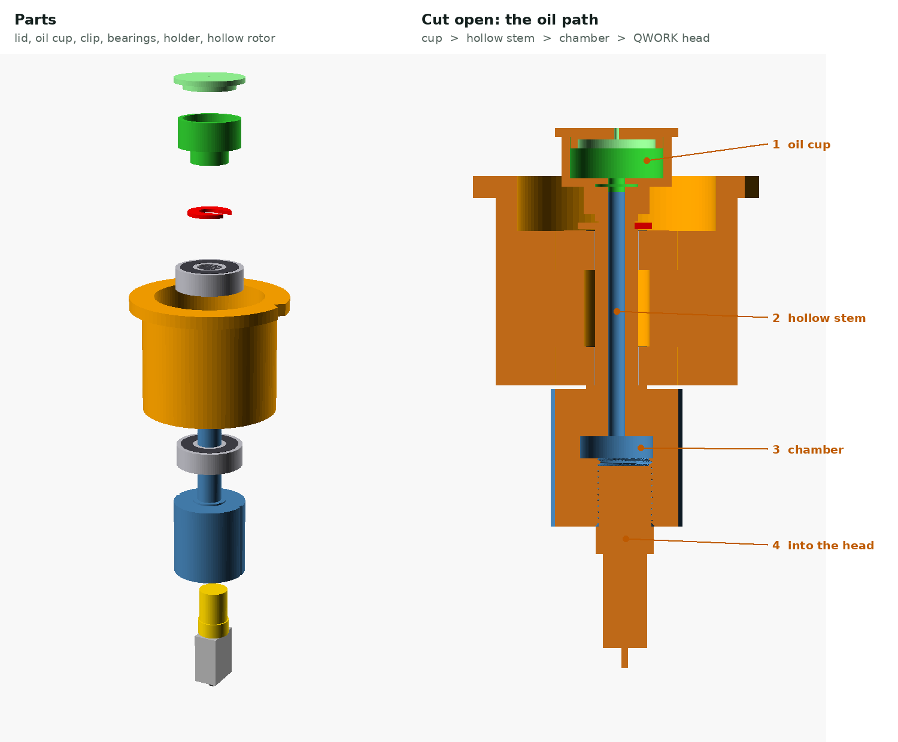

# QikGLASS
Stained Glass Scorer using CNC 3018

A spring-loaded, self-steering glass-scoring head that drops into the spindle clamp of a **CNCTOPBAOS 3018-PRO / PRO-MAX** (GRBL, offline controller), carrying a carbide wheel head from a **QWORK 2–20 mm oil-feed glass cutter**. Swap the 775 spindle out, drop the head in, and score stained-glass patterns straight from an SVG.

**Live tool:** https://belvedereem.github.io/QikGLASS/

## What's here

| Path | What it is |
|---|---|
| `index.html` | **Pattern → G-code** tool plus the build and calibration guide. Lays the job out on a 6 × 4 in glass blank, adds relief scores around curves and corners, and saves a `.nc` file for the controller. |
| `trace.html` | **PNG → SVG**: open a picture of a pattern (black lines on white), set its real size, and trace every enclosed area into a piece outline. Flags pieces that won't fit a 6 × 4 in blank. |
| `select.html` | **Select parts**: open a full pattern SVG, click or box-select just the lines you want, set their cutting order, and send them to the G-code page |
| `cad/qikglass_scoring_head.scad` | Parametric OpenSCAD source for all printed parts |
| `stl/` | Every printed part at the default dimensions (listed below) |
| `images/` | Renders |

## How it works

Five printed parts plus the QWORK cutter head. No rod, bearings, metal spring, screws or clips.

- **Body** sits in the spindle clamp. A long bushing at its bottom guides the shaft.
- **Shaft** drops in from the top. Its flange stops on the body's inner lip, so nothing has to hold it in. Its **domed top** is the swivel: only the centre carries load, so it spins almost freely under 3–5 kg and the wheel steers itself. The split **collet** for the cutter is printed on its bottom end.
- **Spring** is a printed flexure (a PETG tube with staggered slots) whose solid foot sits on the dome. It supplies 2–5 kg of scoring pressure. Print it soft, medium or firm.
- **Cap** screws onto the body's printed thread and presses on the spring: turn it to adjust pressure. Each grip flute is 1/12 turn, or 0.25 mm.
- **Nut** screws up the collet and grips the QWORK head, **1.5 mm off-centre**, so the wheel trails like a caster and steers around curves. The G-code page compensates every path for that offset.

## Simple holder (one part, for first tests)

`cad/qikglass_simple_holder.scad` is a one-piece holder: it drops into the 44.1 mm spindle clamp (34 mm tall), a lip rests on top of the clamp, and the QWORK head's brass thread (9.6 × 11 mm) screws into a modelled female thread in the nose. Two versions are exported, because the thread pitch isn't confirmed yet: `stl/qikglass_simple_holder_m10x1.stl` (1.0 mm pitch) and `stl/qikglass_simple_holder_3-8-24.stl` (3/8"-24, 1.058 mm pitch). Count the crests on the brass thread over 10 mm: 10 means the 1.0 version, about 9½ means the 3/8"-24 version. No spring and no swivel, so the wheel only rolls in the direction it's turned to (straight lines along X), and pressure comes straight from Z depth. Set **Caster offset 0** and **Pre-align Off** on the G-code page when using it. Measure the reach first and set `nose_len` (see the comments in the file).

### Swivel holder (mockup)

If the fixed wheel skids on curves, `cad/qikglass_swivel_holder.scad` is the same holder with two **608 skateboard bearings** (8 × 22 × 7 mm) inside. A printed rotor's 8 mm stem runs through both bearings, a printed C-clip holds it in, and the rotor's head carries the female 3/8"-24 thread **1.5 mm off-centre** so the wheel trails and steers itself. Draft STLs: `stl/qikglass_swivel_holder.stl`, `qikglass_swivel_rotor.stl`, `qikglass_swivel_clip.stl`. Not printed or tested yet.

**Oil feed:** the rotor is hollow. A printed oil cup (about 1.5 ml) presses onto the top of the stem; oil runs down a 3 mm bore into a small chamber above the thread and on into the QWORK head's hollow shank, the way it fed from the original handle. The lid has a 0.8 mm vent: tape over it to slow the flow, uncover it to let oil run. Extra parts: `stl/qikglass_swivel_cup.stl`, `qikglass_swivel_lid.stl`. Set `oil = false` in the `.scad` for a solid rotor.

## Printed parts

| File | Notes |
|---|---|
| `qikglass_body.stl` | Upright, bushing down |
| `qikglass_shaft.stl` | Standing on its collet (already placed), 100 % infill |
| `qikglass_spring_soft/medium/firm.stl` | **PETG, 100 % infill**, foot down. ~0.5 / 0.9 / 1.6 kg per mm, max ~2 / 3.8 / 4.9 kg (estimates, check with a kitchen scale). Start with medium. |
| `qikglass_cap.stl` | Already flipped, top down |
| `qikglass_nut.stl` | Flat |
| `qikglass_pointer.stl` | Zero pointer, slides over the bottom of the shaft (cutter and nut removed) |
| `qikglass_jig.stl`, `qikglass_padstop.stl` | Glass jig and pad stop that bolt to the T-slot bed (fit a 200 mm print bed) |

PETG throughout is best (PLA creeps under constant load). 0.2 mm layers, 4 walls. Fits are tuned with `bush_clr`, `slide_clr` and `thread_clr` in the CAD file.

Also needed: the QWORK 2–6 mm cutter head, six M6 bolts with T-nuts and washers for the jig, 2 mm felt or cork, glass cutting oil, and a kitchen scale.

## Machine notes (from the kit's manual)

- Board: Woodpecker v3.4, GRBL 1.1f. Connects over a CH340 USB serial port at 115200 baud, using Candle (Grblcontrol 1.1.7) from the kit's USB stick.
- Factory speed limits: `$110`/`$111` = 1000 mm/min, `$112` = 800, acceleration 30 mm/s². The G-code page defaults to a 900 mm/min score feed and warns if you set it higher.
- The offline controller runs `.nc` files. No limit switches are fitted (`$22=0`), so zero X/Y at the jig corner with the pointer or by parking.
- The spindle clamp is a split plastic ring with one bolt. Measure its bore for `clamp_d`, and don't overtighten.

## Putting the glass in the same place every time

- **Jig:** `qikglass_jig.stl` is an L that bolts straight onto the 3018's aluminium T-slot bed with M6 bolts and T-nuts. No spoilboard is needed. The bed's slots run along X, 44 mm apart: the front rail's three bolts go in one slot (which keeps it square to X), and the left rail's two bolts drop into the next two slots back. The 6 × 4 blank goes in horizontally, pushed into the corner, and the inside corner is **X0 Y0** for every G-code file. Bolt heads sit 14 mm outside the glass, clear of the cutter. Glue 2 mm felt or cork inside the L. Rails are felt thickness + 1.5 mm tall (`felt_t`), so they stop the glass without touching the wheel. Change `slot_pitch` or `bolt_d` in the CAD file if your bed differs.
- **Pad stop:** `qikglass_padstop.stl` bolts into the front slot against the end of the rail and holds a 30 × 20 mm scrap of glass for the wheel-alignment pad, centred at X179.4 Y10 (the page's defaults).

- **Other sizes:** any rectangle can go in the jig corner. Choose **Custom size** on the G-code page and type the width (along X) and depth in inches or mm. After a job that saves a leftover strip, **Use as next blank** fills in the strip's size, and the page remembers it for next time. Width up to 160 mm, which is where the pad stop sits.
- **Squaring:** jog along the front rail with the zero pointer and tap the jig straight before screwing it down.
- **Zeroing after power-up:** the 3018 has no position memory without homing. Either take the QWORK head and nut out and slide `qikglass_pointer.stl` over the bottom of the shaft (its tip is on the swivel axis), jog it into the jig corner and zero XY, or rely on park-and-power-off: every file ends at X0 Y0, so power off there and zero XY after switching back on. With limit switches you can also enable homing and store the corner as a G54 offset.

## Packing pieces to save glass

Pieces are packed onto 6 × 4 in blanks starting at the front-left corner: left to right along the bottom, then row by row up the blank, with a gap between pieces (6 mm by default). Pieces turn 90° when that keeps the rows low. You can switch this off for glass with a grain. Anything that doesn't fit moves onto another blank, and you save one G-code file per blank.

The unused glass collects in a single strip along the back of the blank. A trim score (**T**) runs edge to edge above the top row. Break it off first and keep the strip for another project. Relief scores stop at the trim line, so the strip isn't marked.

## Relief scores

Glass won't break cleanly around a circle, a semicircle or a deep inside curve on its own. For every closed piece, the G-code page can add relief scores that run out to the edge of the 6 × 4 blank:

- **Circles and outside curves:** a pinwheel of tangent lines, each touching the curve and running to the glass edge.
- **Sharp outside corners:** the side is extended past the corner to the edge.
- **Inside curves (bites):** a comb of parallel lines out through the mouth of the curve.

Relief lines are scored after the outline and stop where they meet it, so nothing crosses. Break the relief pieces first, nearest the edge first, and then the piece. Set the density to Light, Normal or Dense.

## Quick workflow

1. Unplug the spindle, swap in the scoring head, and zero Z on the glass surface (paper-pinch test).
2. Find **score depth** with a kitchen scale: jog down past first contact until it reads about 3 kg (about 3 mm with the medium spring). Fine-tune later by turning the cap.
3. Get a pattern: trace a PNG in `trace.html`, or draw closed piece outlines or score lines in Inkscape (in mm).
4. In `select.html`, click the piece or pieces to cut from one 6 × 4 in blank and choose **Send to QikGLASS**. The G-code page packs them from the front-left corner, adds a trim line and relief scores, and uses extra blanks if needed. Check the warnings, then save the `.nc` file.
5. Oil the wheel, push the blank into the jig corner, and run the file. Break the trim line T first and keep that strip. Then break the relief pieces, and finally run each outline.

Full build, calibration and safety notes are in the page's **Build the head** and **Calibrate & score** tabs.

> ⚠️ Never run a milling file with the glass head fitted, and keep glass files in their own folder on the SD card. The generated files include `M5` and never start the spindle.

## Status

Design stage. The G-code tool has been tested in a browser. The all-printed head has been checked in CAD for fit and collisions, but not printed or run on a machine yet. Spring forces are estimates, so expect to tune fits, the spring and the pressure.
